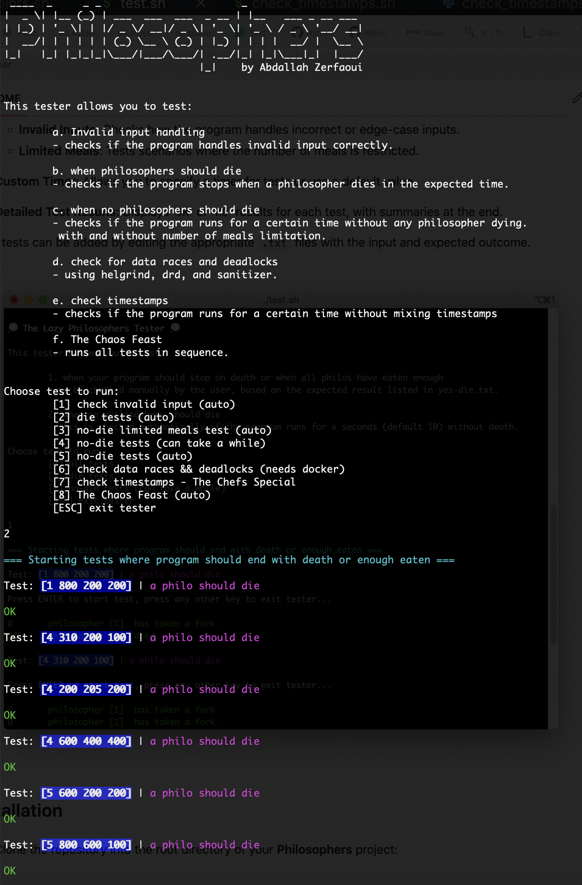

# 42PhilosophersHelper

**42PhilosophersHelper** is a semi-automated testing tool designed for the **Philosophers** project in the **42 curriculum**. It helps you validate the correctness and robustness of your implementation by running various test cases and checking for compliance with expected behavior. 

This tool streamlines testing, identifies potential threading issues, and saves you time by automating repetitive tasks.


## Features

- **Test Categories**:
  - **No Death**: Ensures no philosophers die during simulation (when they shouldn’t).
  - **Death/Stop Conditions**: Validates the program behavior under scenarios like death, enough meals consumed, or invalid inputs.
  - **Invalid Inputs**: Checks how the program handles incorrect or edge-case inputs.
  - **Limited Meals**: Tests scenarios where the number of meals is restricted.

- **Custom Timer**: Allows you to specify a timer for tests or use a default value.

- **Detailed Test Results**: Displays `OK` or `KO` results for each test, with summaries at the end.


More tests can be added by editing the appropriate ```.txt``` files with the input and expected outcome.



## Installation

1. Clone the repository into the root directory of your **Philosophers** project:

    ```bash
    git clone https://github.com/AbdallahZerfaoui/42PhilosophersHelper.git
    ```

2. Ensure your `philo` executable is ready by running `make` in your project directory.

3. Navigate to the **42PhilosophersHelper** directory:

    ```bash
    cd 42PhilosophersHelper
    ```

## Usage

If you haven't already, run ```make``` in your philo directory to create your ```./philo``` executable.  
Then from within the LazyPhilosophersTester directory, run ```./test.sh``` to start the tester.  
Tester takes an optional 2nd argument of the path to your ```philo``` executable.  

Example:  
```bash
./test.sh ../philo
```
If not provided, the tester assumes the path is ```../philo``` - i.e. in same directory as tester directory.


### Arguments

- The script takes an optional argument for the path to your `philo` executable. 
- If not provided, it assumes the default path (`../philo`).

#### Example:

```bash
./test.sh ../philo
```

### Custom Timer for Tests

During execution, the script prompts you to set a timer for the tests. You can:

1. **Enter a custom time** (in seconds) for each test run.
2. **Press Enter** to use the default timer (10 seconds).

The prompt:

```bash
Please enter desired timer for tests or press ENTER to use default (10 seconds):
```

---

## Test Files

The testing script reads scenarios from predefined `.txt` files:

1. **`no-die.txt`**: Tests where no philosopher should die.
2. **`yes-die.txt`**: Tests where the program should stop due to death or enough meals consumed.
3. **`invalid_inputs.txt`**: Edge cases and invalid input tests.
4. **`limited_meals.txt`**: Tests for scenarios with restricted meals per philosopher.

---

## Adding Your Own Tests

You can add custom test cases by editing the respective `.txt` files:

### Format:

- Each **test case** spans **two lines**:
  1. **First Line**: Input arguments to the program.
  2. **Second Line**: Description of the expected outcome.

#### Example:

```text
5 800 200 200
No philosopher should die.

5 800 200 200 3
Simulation should stop after 3 meals per philosopher.
```

---

## How It Works

1. **No Death Tests**:
   - The script runs scenarios where no philosopher should die.
   - It checks if the simulation runs for the specified time without any deaths.

2. **Death/Stop Tests**:
   - Validates program behavior under death or stopping conditions.
   - Prompts you to check the expected outcomes manually.

3. **Invalid Input Tests**:
   - Executes edge cases and invalid inputs to ensure the program doesn't crash and exits gracefully.

4. **Limited Meals Tests**:
   - Confirms that each philosopher eats the required number of meals.
   - Compares the actual eating count to the expected total (`number_of_philosophers * number_of_meals`).

5. **Test Results**:
   - Each test displays a detailed result (`OK` or `KO`) based on the behavior of your program.
   - A final summary shows the total passed and failed tests.


### Adding tests
If you wish to add your own tests, open either:
1. ```no-die.txt``` for tests where philos aren't supposed to die, or
2. ```yes-die.txt``` for tests where the program should stop (death, eaten enough, error).  

The 1st line should be your test case, separated by spaces. This is what is inputted into your program.  
The 2nd line should be the expected outcome. This is outputted during the tester for checking purposes.  

Example:  
```text
4 310 200 100
a philo should die
5 800 200 200 7
no one should die, simulation should stop after 7 eats
```

## Helgrind Testing

Helgrind is used to detect potential threading issues in your `philo` program. However, running Helgrind requires a Docker environment due to its specific setup requirements. 

### Setting up Docker for Helgrind Tests
1. **Install Docker**: Ensure you have Docker installed on your system. If not, you can follow the installation guide [here](https://github.com/Scarletsang/Dorker).
2. **Start Docker**: Make sure Docker is running before proceeding with the tests.
3. **Run Helgrind Tests**: During the test selection, choose the option `Check Data Races && Deadlocks`. This will trigger the Helgrind checks within a Docker container.

### Notes
- Helgrind tests are optional but highly recommended for catching concurrency-related bugs.
- Ensure your program compiles correctly and all dependencies are included before running the tests.

## Credits
Timed-checker Python script ```PhilosophersChecker.py``` [(link)](https://gist.github.com/jkctech/367fad4aa01c820ffb1b8d29d1ecaa4d) was written by [JKCTech](https://gist.github.com/jkctech) and modified slightly by me [MichelleJiam](https://gist.github.com/jkctech).  
[Progress bar function](https://stackoverflow.com/a/52581824) written by Vagiz Duseev, found on StackOverflow.
